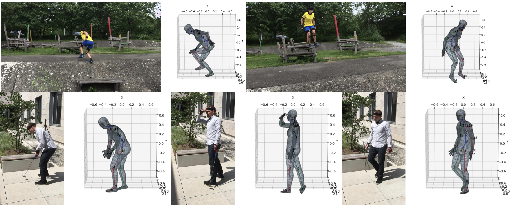

# Fitting SMPL Parameters to 3D Keypoints



## Installation
First you need to clone the repo:
```
git clone https://github.com/yc4ny/SMPL-Fitting.git
cd SMPL-Fitting
```
This code has been tested on **Python 3.7**, **Pytorch 1.7.1**, **CUDA 11.0**.
We recommend creating a virtual environment for this repository. You can use conda:
```
conda create -n smplfitting python==3.7
```

Then, you need to install Pytorch according to your CUDA version and GPU requriements. This is for CUDA 11.0, but you can adapt accordingly: 
```
pip install torch==1.7.1+cu110 torchvision==0.8.2+cu110 torchaudio==0.7.2 -f https://download.pytorch.org/whl/torch_stable.html
```

Then, you can install the rest of the dependencies with: 
```
pip install -r requriements.txt
```

## Preprocessing Files

#### 1. Prepare **.npy** files containing the 3D Keypoint Data
You must preprocess your data to match the input format. 
The code will take a **.npy** file as input containing an array of shape $(N \times J \times 3)$, where $N$ is the number of frames in the sequence, $J$ the number of joints in the 3D Keypoint data. For example, if there is a $(500 \times 24 \times 3)$ array given as input, in the data there are $24 \times 3D$ Joints per frame and $500$ frames in total. Put all the processed **.npy** files in a single folder, it will be used for the **--dataset_dir** flag in the demo. 

#### 2. Create a configs.json file 
There is a $configs/3DPW.json$


## Demo
To perform fitting, you can run:
```bash
python fit.py --dataset_name {name of the data} --dataset_dir {directory of the preprocessed .npy files}
```


## Acknowledgements
Parts of the code are taken or adapted from the following repos:
- [SMPLPytorch](https://github.com/gulvarol/smplpytorch)