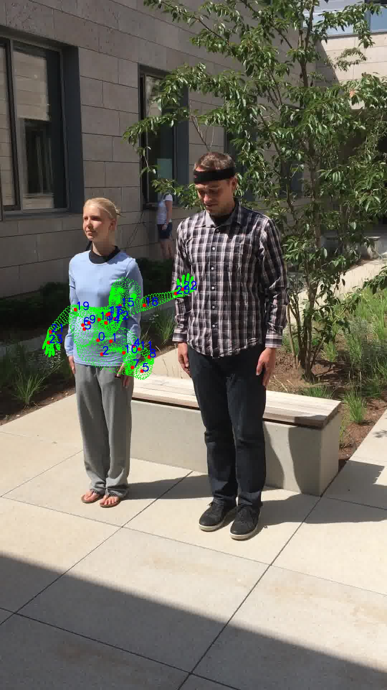
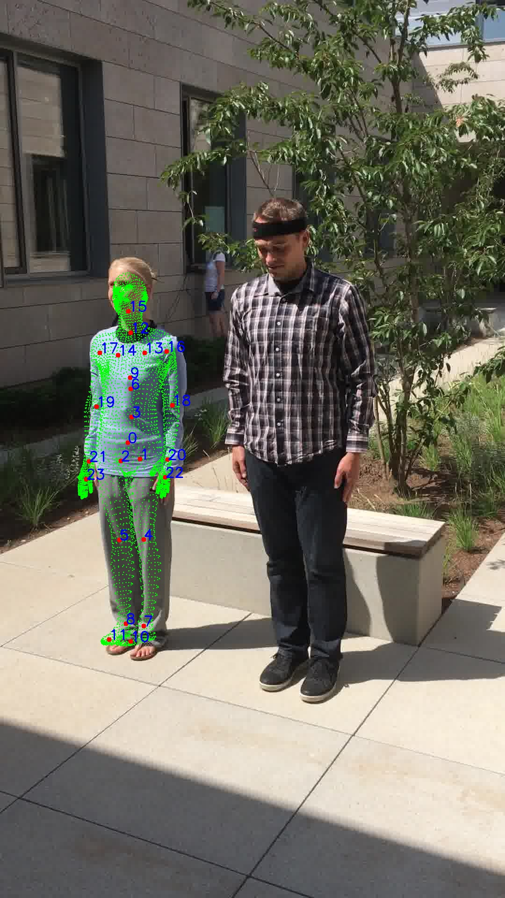

# Obtaining SMPL θ,β parameters
This is my implementation of optimizing SMPL parameters from ground truth 3D joints.<br/>
For testing, I've used the <a href="https://virtualhumans.mpi-inf.mpg.de/3DPW/">3D Poses in the Wild</a> dataset for obtaining ground truth 3D joints.<br/>
<p align= "center">

 
</p>
> - <strong>Left: Before Optimization, Right: After Optimization.</strong> <br/>
> - Optimized Joint Locations are marked in red points. <br/>
> - SMPL Joint Numbers are in blue text.<br/> 
> - Green mesh is consisted of 6930 vertices obtained from the SMPL model<br/> 
<br/>

## Environment Setup
> Note: This code was developed on Ubuntu 20.04 with Python 3.7. Later versions should work, but have not been tested.
Create and activate a virtual environment to work in, e.g. using Conda:

```
conda create -n smpl_fitting python=3.7
conda activate smpl_fitting
```
Install the remaining requirements with pip:
```
pip install -r requirements.txt
```
You must also have _ffmpeg_ installed on your system to save visualizations. <br/><br/>

### Download SMPL models
Download [SMPL Female and Male](https://smpl.is.tue.mpg.de/) and [SMPL Netural](https://smplify.is.tue.mpg.de/), and rename the files and extract them to `<current directory>/smpl/models/`, eventually, the `<current directory>/smpl` folder should have the following structure:
   ```
   smpl
    └-- models
    	└-- basicModel_f_lbs_10_207_0_v1.0.0.pkl
		└-- basicmodel_m_lbs_10_207_0_v1.0.0.pkl
		└-- basicModel_neutral_lbs_10_207_0_v1.0.0.pkl
   ```
### Install the smplpytorch package
You need this package to obtain the `SMPL_Layer` used for optimization.

    ```
    pip install smplpytorch
    ```

### OpenPose
> - [OpenPose](https://github.com/CMU-Perceptual-Computing-Lab/openpose) is used to detect 2D joints from arbitrary RGB videos.<br/>
> - Please install OpenPose and run it on your undistorted image frames to locate the 2D keypoints. <br/> 
> - Before running OpenPose, make sure that the input images are <b>undistorted</b>. There is a MATLAB code in the repo ```undistort_image.m``` that undistort images. Just modify the camera parameters and the structure of the folder directory and you will be set to go. 
> -  For the format of the output pose, this code is based on the "BODY_25" format, please add the ```--model_pose BODY_25 ``` flags in order to match the format of the output .json files used in this repo. <br/>
> - The output .json file should look something like: <br/>
```{"version":1.3,"people":[{"person_id":[-1],"pose_keypoints_2d":[2055.39,265.531,0.874508,2267.43,542.444,0.678595,2190.91,559.855,0.566347,2037.84,865.877,0.602067,1766.9,772.016,0.519303,2326.48,542.172,0.704926,2055.42,901.382,0.770255 ... ]}```
<p align="center">
  
</p>


